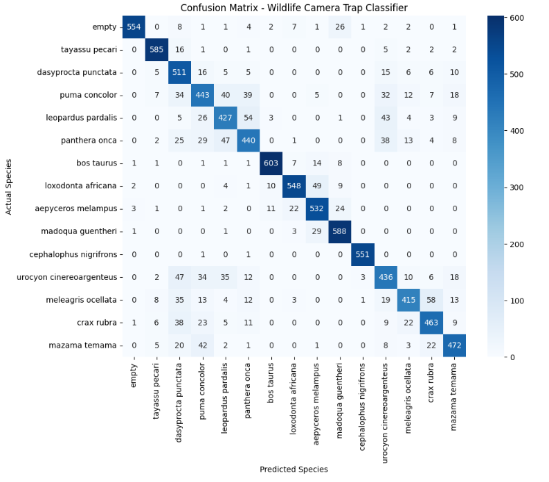
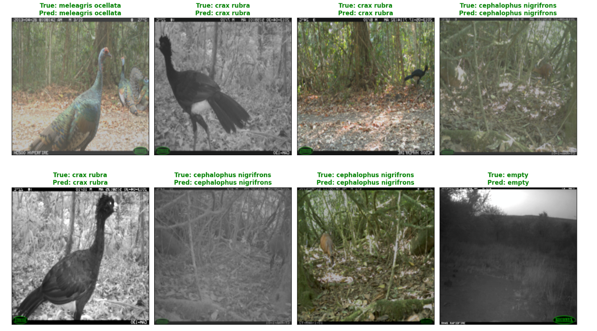
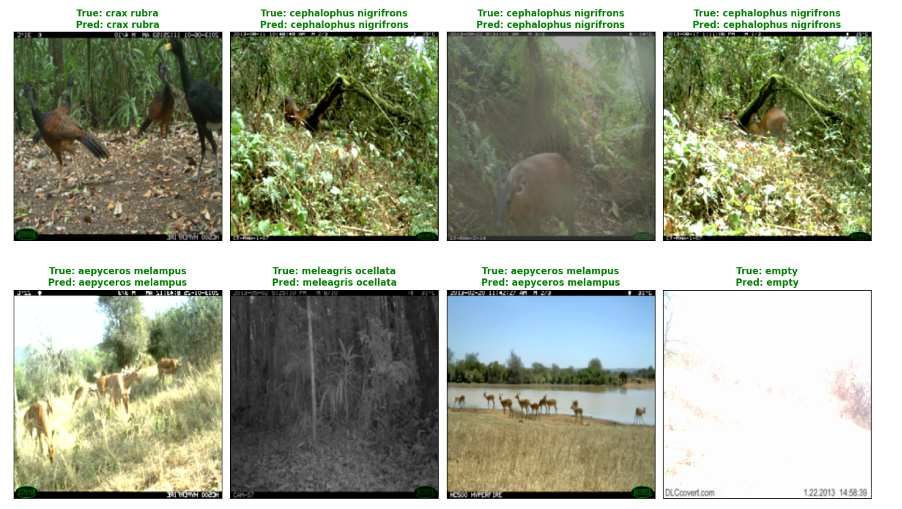
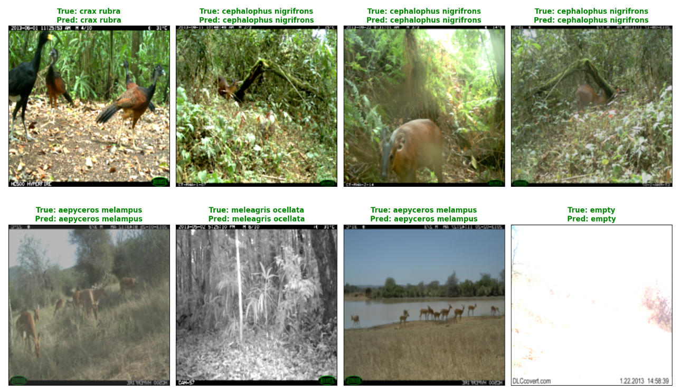
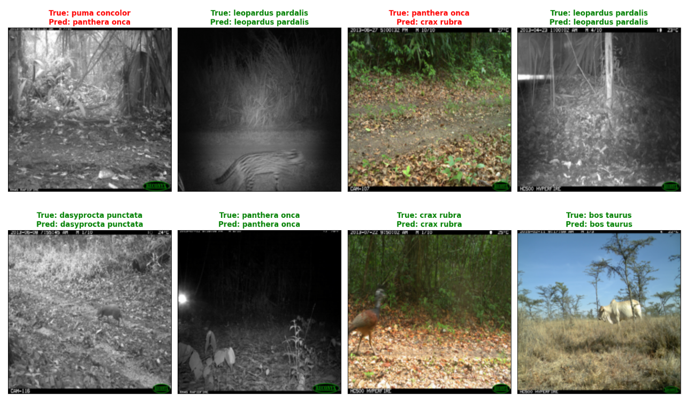

# Automating Wildlife Identification with Deep Learning

By Jose A. Martinez, Andrew Choi, Pavan Patel, Seth Sandberg

## Introduction

Wildlife camera traps are an important tool for studying animal populations and monitoring natural environments. These cameras are placed in outdoor locations and automatically capture images when motion is detected. This makes them useful for collecting large amounts of wildlife data without requiring constant human observation.

However, the large number of images created by trail cameras also creates a major data science challenge. Manually sorting through thousands of images and labeling the animal species in each one is time-consuming. A machine learning model that can automatically identify animals from camera trap images would make this process much faster and more scalable.

For this project, our team built a computer vision pipeline using the iWildCam dataset. The goal was to classify animal species from trail camera images using a deep learning model. Our final system used transfer learning with a pretrained convolutional neural network, balanced data sampling, weighted loss, image augmentation, and validation visualizations to evaluate performance.

Our model achieved strong validation performance, with a validation Macro-F1 score of 0.8955. This showed that our pipeline was able to learn meaningful visual patterns associated with the target animal classes and classify many validation images accurately, even under challenging trail camera conditions.

## Project Goal

The main goal of this project was to design and evaluate a deep learning pipeline for automated wildlife identification. The model takes an image from a remote trail camera and predicts which animal species appears in the image.

This problem is a strong example of applied data science because it involves more than simply training a neural network. The dataset contains real-world image variation, including differences in lighting, background, camera angle, animal pose, image quality, and class frequency. Because of this, the project required careful preprocessing, model design, training strategy, and evaluation.

Our project focused on the following objectives:

1. Load and process metadata from the iWildCam dataset.
2. Build an image classification dataset using animal classes with enough examples for meaningful training and evaluation.
3. Train a convolutional neural network using transfer learning.
4. Address class balance using weighted sampling and weighted loss.
5. Evaluate the model using accuracy, macro F1 score, a confusion matrix, and prediction visualizations.
6. Interpret the model’s performance and understand the effectiveness of the pipeline.

## Dataset

The dataset used in this project was the iWildCam camera trap dataset. This dataset contains images captured by remote wildlife cameras. Each image is associated with metadata, including the image file name and the animal category label.

Because the full dataset contains many animal categories with very different numbers of images, our team focused on animal classes that had enough examples to support reliable training and validation. This was important because classes with only a very small number of images would make the model harder to train and would also make evaluation less meaningful. A class with only a few examples does not provide enough visual variation for the model to learn stable patterns.

To keep the project computationally manageable while still making the task realistic, we selected a group of common animal categories and capped the number of images per class. This helped reduce the impact of extreme class imbalance while still preserving the main challenge of wildlife image classification.

Using this selected dataset made the training process more manageable in the Kaggle GPU environment. The model still had to distinguish between multiple animal species under natural camera trap conditions, including daytime images, nighttime infrared images, shadows, glare, motion blur, and partial occlusion.

Balancing the dataset also helped prevent the model from being dominated by one extremely common species. In many real-world datasets, some classes appear much more frequently than others. If this imbalance is not handled, the model may learn to over-predict the most common classes. By using a more balanced dataset, our model had a better opportunity to learn the visual features of each animal category.

## Data Preprocessing

The first step in our pipeline was loading the iWildCam metadata. The image metadata, annotation metadata, and category metadata were loaded from the dataset’s JSON annotation file. These were converted into pandas DataFrames so that the image paths, labels, and category names could be processed more easily.

After loading the metadata, we filtered the dataset to keep animal categories with sufficient representation. We then sampled images from each class and created a label mapping that converted each category ID into a numerical class index.

Each image was loaded using a custom PyTorch `Dataset` class. This class retrieved the image file path, opened the image using PIL, converted it to RGB format, applied the selected transformations, and returned the image tensor along with its label.

The image transformations included:

- resizing each image to match the model input size,
- random horizontal flipping,
- random resized cropping,
- color jitter for brightness and contrast,
- random rotation,
- conversion to a PyTorch tensor,
- normalization using ImageNet mean and standard deviation values.

These transformations were important because pretrained image models expect images in a standard size and normalized format. The augmentation steps also helped the model become more flexible by exposing it to small variations in image appearance during training.

For validation, we used a cleaner set of transformations without random augmentation. This helped keep evaluation consistent because the validation images were not randomly changed each time they were passed through the model.

## Model Architecture

The model used for this project was a pretrained convolutional neural network. We used transfer learning so that the model could start with general image recognition features instead of learning from scratch.

Transfer learning was useful because the lower layers of a pretrained image model already contain general visual knowledge. These layers can detect basic features such as edges, textures, shapes, and patterns. Since wildlife classification is also an image recognition task, starting from pretrained ImageNet weights gave our model a stronger foundation than random initialization.

To adapt the model to the wildlife classification task, we replaced the original final classifier layer with a new classification layer that produced outputs for our selected animal categories.

Most of the pretrained layers were frozen. This means their weights were not updated during training. Freezing the earlier layers helped preserve the general visual features learned from ImageNet and reduced the amount of training required.

The later feature extraction layers were unfrozen so that the model could learn more task-specific patterns from wildlife images. The final classification layer was also trained from scratch. This gave the model a balance between using pretrained general image features and adapting to the specific animal species in the dataset.

## Training Strategy

The model was trained using an optimizer suited for deep learning fine-tuning. We used separate learning rates for the pretrained feature layers and the new classifier layer. The classifier layer used a larger learning rate because it was newly initialized, while the pretrained feature layers used a smaller learning rate because they only needed fine tuning.

During each epoch, the pipeline ran both a training phase and a validation phase. In the training phase, the model updated its weights using backpropagation. In the validation phase, the model was evaluated without updating weights.

For each phase, the code tracked loss and accuracy. This made it possible to monitor whether the model was learning over time and how well it performed on validation images.

We also used a learning rate scheduler to reduce the learning rate when validation performance stopped improving. This helped stabilize training and allowed the model to continue improving more carefully after the early epochs.

## Handling Class Balance

Even after selecting classes with sufficient data, some class imbalance can still remain. To address this, we included additional class balancing methods in the training pipeline.

First, we calculated the number of training examples in each class. Then we computed class weights using the inverse of the class counts. Classes with fewer examples received larger weights, while classes with more examples received smaller weights.

These weights were used in two ways.

The first method was a `WeightedRandomSampler`. This sampler controlled how training batches were created. Instead of sampling all images uniformly, it used sample weights to help balance class representation during training.

The second method was weighted cross entropy loss. Cross entropy is a standard loss function for classification, but the weighted version allows some classes to have a larger effect on the loss. This helps prevent the model from ignoring less frequent classes.

Together, weighted sampling and weighted loss helped ensure that the model learned from all selected animal categories instead of becoming biased toward one class.

## Evaluation Method

After training, the model was evaluated on the validation set. The evaluation step collected all predicted labels and true labels, then calculated performance metrics.

One of the main metrics we used was Macro-F1. Macro-F1 is useful because it treats each class equally instead of allowing larger classes to dominate the score. This is especially important in animal classification tasks, where each species should be identified reliably.

Our model achieved a validation Macro-F1 score of  0.8955. This indicates that the classifier performed strongly across the selected animal categories while still accounting for class-level performance.

In addition to numerical metrics, we generated a confusion matrix. The confusion matrix shows how often each true class was predicted as each possible class. This made it easier to see whether the model was confusing certain animals with each other.

The confusion matrix showed that the model performed strongly across the selected classes. Most predictions appeared along the diagonal, meaning the predicted labels matched the true labels for the majority of validation examples.

Some of the remaining mistakes occurred between visually similar species, such as the curassow and the turkey. This mix-up makes sense because both animals are medium-sized ground birds with similar body shapes, posture, and visual features in trail camera images. In some photos, lighting, distance, motion blur, or partial occlusion can make these species harder to distinguish.

Other errors were caused by the quality of the image itself. Several validation examples were extremely difficult even for a human to interpret. Some images were dark, blurry, overexposed by glare, or contained animals that were far away or partially hidden by vegetation. In these cases, the model was not simply confusing obvious images. It was being asked to classify trail camera photos where the animal was barely visible or the visual evidence was limited.

These errors show that the model learned the main visual patterns for each class, but still struggled occasionally when images were low quality or when two animals shared similar physical characteristics.

## Visualizing Model Predictions

Numerical metrics are useful, but they do not always show what the model is doing on actual images. To better understand the model’s predictions, we created visualization grids of validation images.

The visualization step selected batches of validation images, passed them through the trained model, and displayed examples in a grid. Each image was shown with its true label and predicted label. Correct predictions were shown in green, while incorrect predictions were shown in red.

This visualization made the evaluation more interpretable. Instead of only seeing a metric such as Macro-F1, we could inspect specific examples and confirm that the model was correctly identifying animals in real images.

The visualizer was also useful for understanding the model’s mistakes. Many of the incorrect predictions occurred on images where the animal was difficult to see because of darkness, glare, distance, or partial occlusion. This helped explain why the model made certain errors and showed that some mistakes were connected to real image quality challenges rather than a complete failure to learn the animal classes.

## Results

The final model achieved strong performance on the validation set, with a validation Macro-F1 score of  0.8955. This result showed that the transfer learning approach was effective for the selected wildlife classification task.

Several design choices contributed to this performance:

1. **Transfer learning:** Starting with pretrained ImageNet weights allowed the model to use general visual features from the beginning of training.

2. **Fine tuning:** Unfreezing the later feature extraction layers allowed the network to adapt higher-level visual features to the animal classification problem.

3. **Dataset construction:** Selecting classes with sufficient training examples helped make the classification task more stable and allowed the model to learn meaningful patterns for each species.

4. **Weighted sampling and weighted loss:** These methods helped the model treat the selected classes more evenly during training.

5. **Data augmentation:** Random crops, flips, rotations, and color jitter exposed the model to variation in image appearance.

6. **Visual diagnostics:** The confusion matrix and prediction grids made it possible to evaluate the model beyond a single number.

Overall, the results showed that our pipeline was able to learn useful visual representations for wildlife classification and apply them successfully to validation images. The model performed well on clear examples and still handled many challenging trail camera conditions.

## Discussion

This project demonstrated how a pretrained convolutional neural network can be adapted to a real-world image classification problem. The iWildCam dataset is more complex than a simple classroom dataset because the images come from outdoor camera traps and contain natural variation in lighting, background, animal position, and image quality.

Our model handled these challenges well on the selected dataset. By using transfer learning, the pipeline avoided the need to train a large model from scratch. By fine tuning later layers, the model was able to adjust to wildlife-specific features. By using weighted loss and weighted sampling, the training process remained focused on all selected animal categories.

One of the most important parts of the project was building the full pipeline from metadata loading to final evaluation. The project was not just about calling a pretrained model. It required processing the annotation files, constructing a usable dataset, defining a custom PyTorch dataset class, applying transformations, building dataloaders, modifying the model architecture, training the network, computing evaluation metrics, and visualizing predictions.

The prediction grids were especially useful because they showed the actual image conditions the model had to handle. Some validation images were clear and easy to classify, while others had poor lighting, glare, motion blur, or only a small visible part of the animal. This helped connect the numerical results to the real visual difficulty of the dataset.

## Software Engineering Perspective

From a software engineering perspective, the project emphasized the importance of building a clear and reproducible pipeline. Each part of the code had a specific role.

The metadata loading section handled the raw iWildCam annotations and converted them into DataFrames. The filtering section selected the animal classes used in the experiment. The custom dataset class connected the metadata to the actual image files. The transformations standardized and augmented the input images. The dataloaders handled batching and sampling. The model section defined the transfer learning setup. The training loop handled optimization and evaluation. Finally, the visualization section produced interpretable outputs for the final report.

This structure made the code easier to understand and modify. For example, the number of classes, the image transformations, the model architecture, and the training parameters could all be adjusted without rewriting the entire pipeline.

The project also showed how machine learning systems require both modeling decisions and engineering decisions. The performance of the final model depended not only on the neural network architecture, but also on how the dataset was prepared, how the classes were balanced, how the loss function was defined, and how the results were evaluated.

## Conclusion

This project developed a complete deep learning pipeline for automatic wildlife identification using the iWildCam dataset. The final system used a pretrained convolutional neural network, transfer learning, class balancing, weighted loss, data augmentation, and visual evaluation tools.

Our model achieved a validation Macro-F1 score of 0.8955 on the selected animal classes. This strong performance showed that the pipeline was able to learn meaningful visual patterns from trail camera images and classify many validation examples accurately.

Beyond the final metric, the project demonstrated the full process of applied machine learning: preparing the data, designing the model, handling class balance, training the network, evaluating performance, and interpreting results through visualizations.

Overall, this project shows how computer vision can be used to automate wildlife identification and reduce the amount of manual effort required to analyze trail camera data. With further expansion to more species and additional evaluation tools, this type of pipeline could become a useful tool for large-scale wildlife monitoring.
